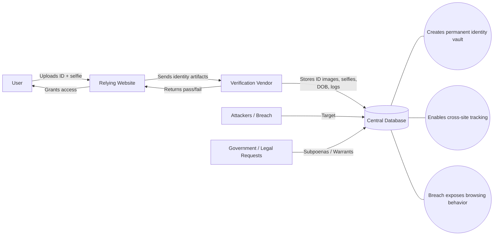
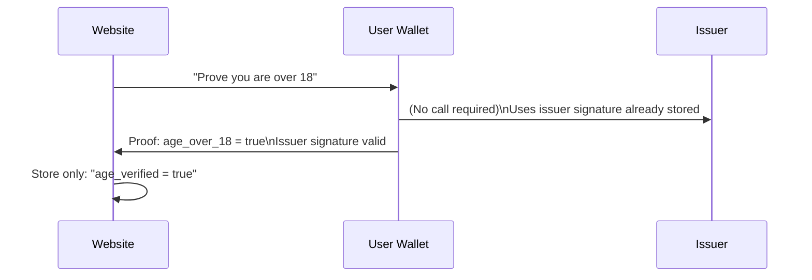

# Diagrams - Privacy-Preserving Age Verification

This file contains simple diagrams illustrating how privacy-preserving age verification can work, and how identity-harvesting implementations typically work.

These diagrams use Mermaid syntax, which renders in GitHub Markdown.

---

## Diagram 1 - Privacy-Preserving Age Verification (Good Model)

```mermaid
flowchart LR
  U[User] -->|Requests age credential| I[Trusted Issuer<br>(Gov / Bank / Carrier)]
  I -->|Issues credential<br>(stored on device)| W[User Wallet<br>(phone)]
  RP[Relying Website] -->|Requests proof:<br>Over 18?| W
  W -->|Returns proof:<br>Yes/No only| RP
  RP -->|Grants or denies access| U

  note1((No ID upload to websites))
  note2((No DOB shared))
  note3((No name shared))
  note4((No cross-site identifier))

  RP --- note1
  RP --- note2
  RP --- note3
  RP --- note4
```

---

## Diagram 2 - Identity Harvesting Model (Bad Model)



---

## Diagram 3 - What the Website Should Receive (Minimum Disclosure)


