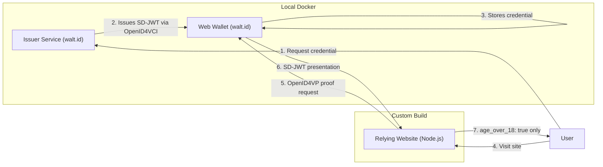
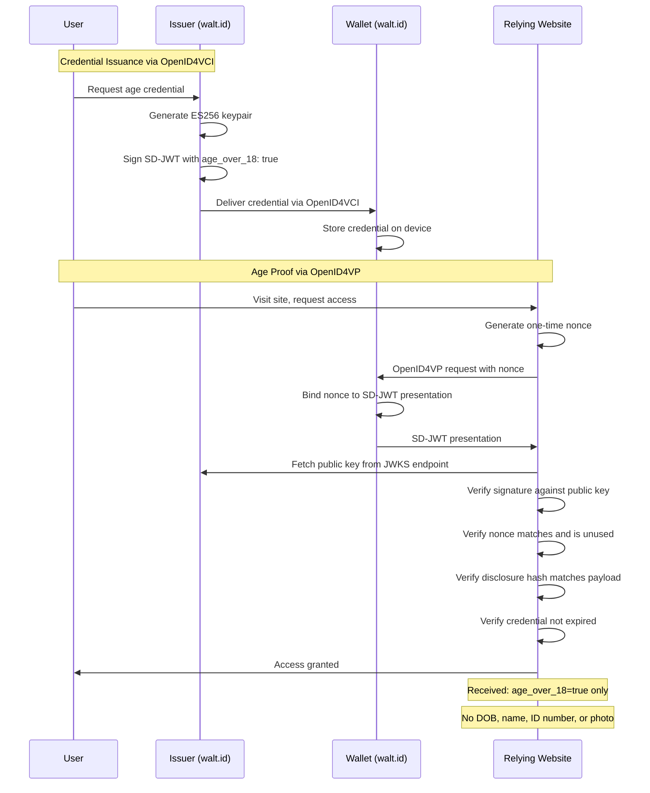

# Prototype Plan - Privacy-Preserving Age Verification
Date: 2026-02-17
Updated: 2026-02-17

---

## Goal

Build a small, self-contained working prototype that demonstrates the full privacy-preserving age verification flow end-to-end. The prototype must serve both as a technical foundation and as a convincing advocacy demo for policy and press audiences.

The prototype deliberately aligns with the EU Digital Identity Wallet (EUDI) architecture — using the same standards and protocols — so it can be cited as a working example of what EUDI-style verification looks like in practice.

---

## Approach: Hybrid

Rather than building every component from scratch, the prototype uses a hybrid approach:

- **Issuer + Wallet**: Use [walt.id](https://walt.id) open-source tooling, which implements the EUDI-aligned stack (OpenID4VCI, OpenID4VP, SD-JWT) and can run locally via Docker
- **Relying website**: Built custom — this is the advocacy-critical component that clearly demonstrates what data the site does and does not receive

This approach means:
- The demo uses real EUDI-compatible tooling, not a toy implementation
- It is credible to say "this uses the same stack the EU is deploying"
- The relying website remains simple, readable, and purpose-built for advocacy clarity
- Effort on the issuer/wallet side is significantly reduced

---

## Components

| Component | Implementation | Role |
|---|---|---|
| **Issuer service** | walt.id issuer kit (Docker, local) | Simulated trusted issuer. Issues a signed SD-JWT credential containing only `age_over_18: true`. Labeled clearly as a demo issuer standing in for a government or bank. |
| **User wallet** | walt.id web wallet (Docker, local) | Stores the credential on the user's device. Handles credential presentation via OpenID4VP. |
| **Relying website** | Custom (Node.js / TypeScript) | Requests age proof via OpenID4VP, verifies the SD-JWT signature, and displays only what it received — making explicit that no DOB, name, or ID was shared. |

---

## Credential Format: SD-JWT

SD-JWT is the correct choice because:

- It is the primary selective disclosure format used by EUDI
- It is the most deployable format today with solid library support
- It aligns with the IETF standard that governments and the EU wallet are converging on
- It is significantly simpler to implement than BBS+ or ZKP-based schemes

The credential will contain only: `age_over_18: true` — no date of birth, no name, no ID number.

---

## Protocols

| Protocol | Role |
|---|---|
| OpenID4VCI | Issuance of credential from issuer into wallet |
| OpenID4VP | Presentation of proof from wallet to relying website |
| SD-JWT | Credential and proof format (selective disclosure) |

These are the same protocols EUDI mandates. This is intentional.

---

## Tech Stack

| Component | Stack |
|---|---|
| Issuer + Wallet | walt.id (Docker) |
| Relying website | Node.js / TypeScript, Express |
| Credential format | SD-JWT via `@sd-jwt/core`, `jose` |
| Local orchestration | Docker Compose |

---

## The Flow

```
1. User visits Issuer (walt.id)  →  clicks "Get age credential"
   (In real life: issuer verifies DOB via gov record; here it is a button for demo purposes)

2. Issuer generates SD-JWT signed with its private key via OpenID4VCI
   → credential is issued into the walt.id web wallet

3. Wallet stores credential (device-side)

4. User visits Relying Website (custom)  →  clicks "Prove I'm over 18"

5. Relying website sends OpenID4VP presentation request to wallet

6. Wallet returns SD-JWT presentation containing only age_over_18: true

7. Relying website verifies issuer signature
   → displays: "age_over_18: true — no other data received"
   → explicitly lists what was NOT received: no DOB, no name, no ID number
```

---

## Effort Estimate

| Task | Effort |
|---|---|
| Set up walt.id issuer + wallet via Docker Compose | ~0.5 days |
| Configure issuer to issue age-only SD-JWT credential | ~0.5 days |
| Build relying website (OpenID4VP request, SD-JWT verification, result display) | ~1 day |
| Trust model UI (received / verified / not received panels, tamper demo) | ~0.5 days |
| Wiring, local dev setup, README | ~0.5 days |
| **Total** | **~3 days** |

---

## In Scope

- walt.id issuer configured to issue a credential with `age_over_18: true` only
- walt.id wallet stores and presents the credential
- Custom relying website requests proof via OpenID4VP
- Relying website verifies SD-JWT and displays result with explicit disclosure log
- Everything runs locally via Docker Compose and a single start command
- README explaining how to run it and what each component represents

---

## Out of Scope (for this prototype)

- Unlinkability across verifier requests (requires BBS+ or ZKP — significantly more complex)
- Credential revocation
- Real issuer integration (no public gov/bank issuance APIs exist yet)
- Mobile wallet (browser-based wallet only)
- Production security hardening
- Deployment to public infrastructure

---

## Issuer Note

Real-world issuers (government, bank, mobile carrier) do not yet expose public OpenID4VCI issuance endpoints to the general public. The prototype uses a clearly labeled simulated issuer via walt.id. The architecture is real and replaceable — when production issuers exist (as EUDI member states deploy them), only the issuer endpoint configuration needs to change. Everything else remains valid.

---

## EUDI Alignment

This prototype intentionally mirrors the EUDI architecture:

| EUDI concept | Prototype equivalent |
|---|---|
| Member state issuer | walt.id issuer (demo) |
| EUDI Wallet app | walt.id web wallet |
| Relying party | Custom relying website |
| OpenID4VCI | Used for issuance |
| OpenID4VP | Used for presentation |
| SD-JWT PID | SD-JWT with `age_over_18: true` |

This alignment is deliberate. The prototype can be presented as: "a working demonstration of what EUDI-style age verification looks like for any website, built with the same open standards the EU has mandated."

---

## Trust Model: Signing, Validation, and Replay Prevention

A core goal of the prototype is to make the trust model visible — not just assert that verification happened, but show cryptographically that the token is genuine, untampered, and cannot be reused.

### Issuer keypair and key publication

The issuer generates an **ES256** asymmetric keypair on startup (the same curve EUDI uses). The private key signs every credential it issues and is never shared. The public key is published at a well-known endpoint:

```
GET http://localhost:3001/.well-known/jwks.json
```

Any relying party can independently fetch and verify the issuer public key — no central authority needed, no phone-home to the issuer at verification time. This mirrors exactly how EUDI relying parties verify member state issuer signatures.

---

### What the SD-JWT token looks like

An issued credential has three parts: a signed JWT header and payload, a signature, and one or more disclosures appended after a `~` separator.

**Header** (identifies the algorithm and key)
```json
{
  "alg": "ES256",
  "typ": "sd-jwt",
  "kid": "issuer-key-1"
}
```

**Payload** (what the issuer commits to — note: the claim itself is hashed, not plaintext)
```json
{
  "iss": "http://localhost:3001",
  "iat": 1771366681,
  "exp": 1802902681,
  "nbf": 1771366681,
  "vct": "AgeCredential",
  "_sd_alg": "sha-256",
  "_sd": [
    "aHR0cHM6Ly9leGFtcGxlLmNvbS9hZ2Vfb3Zlcl8xOA=="
  ]
}
```

The `_sd` array contains a **salted hash** of the disclosed claim — not the claim value itself. This is the core of SD-JWT selective disclosure: the issuer commits to the claim cryptographically without embedding it in plaintext in the JWT body.

**Disclosure** (base64url-encoded, appended after `~`)
```json
["random-salt-value", "age_over_18", true]
```

The full token as transmitted:
```
<base64url-header>.<base64url-payload>.<signature>~<base64url-disclosure>
```

The relying party verifies trust in three steps:
1. Verify the JWT signature against the issuer public key from the JWKS endpoint
2. Hash the disclosure and confirm it matches the `_sd` entry in the payload
3. Extract `age_over_18: true` from the verified disclosure

If the disclosure is tampered with, step 2 fails. If the signature is forged or the token is modified, step 1 fails.

---

### Replay prevention via nonce

When a user clicks "Prove I'm over 18", the relying website first issues a **nonce** — a one-time random challenge — before the wallet responds. The wallet binds this nonce into its presentation. The relying website verifies:

- the nonce matches what it issued for this session
- the nonce has not been seen before (one-time use)
- the presentation has not expired (`exp` check)

This means:
- A presentation intercepted in transit cannot be replayed elsewhere
- The same presentation cannot be submitted twice to the same site
- A presentation generated for Site A cannot be used on Site B

---

### Token lifecycle

```
Issuer signs credential     private key used once, not stored after signing
Credential stored           user wallet (localStorage), not the issuer
Presentation generated      wallet binds nonce + disclosure, signs presentation
Relying party verifies      public key from JWKS, nonce check, hash check, expiry check
Relying party stores        nothing — session flag only: age_verified = true
```

---

### What the UI makes visible

Rather than silently passing these checks, the relying website shows three explicit panels:

| Panel | Content |
|---|---|
| **Received** | `age_over_18: true`, issuer identifier, credential expiry |
| **Verified** | Signature valid (public key shown), nonce matched, disclosure hash confirmed, not expired |
| **Not received** | Name — absent. Date of birth — absent. ID number — absent. Address — absent. Photo — absent. |

An optional **tamper demo** mode deliberately corrupts the token and reruns verification, showing an explicit failure. This is useful for press and policy audiences to demonstrate that the trust model is cryptographic, not cosmetic.

---

## Diagrams

### Component Architecture



### Full Protocol Flow



---

## Deployment Architecture

### Advocacy site

- Static site generated from the existing markdown docs in this repo
- Hosted on **Netlify** (free tier, auto-deploys on every push to main)
- Netlify renders the docs as a clean public-facing site without managing any infrastructure
- URL: `yourdomain.com`

### Prototype demo

Hosted on **AWS EC2** (t3.small, ~$15/month) running Docker Compose with **Caddy** as a reverse proxy, handling HTTPS automatically via Let's Encrypt.

Subdomains:

```
issuer.yourdomain.com   →  walt.id issuer service
wallet.yourdomain.com   →  walt.id web wallet
verify.yourdomain.com   →  custom relying website
```

### Environment configuration

All service URLs are environment-variable driven — no hardcoded `localhost` references. The same Docker Compose file works locally and in production by swapping a `.env` file:

```
# .env.local
ISSUER_URL=http://localhost:3001
WALLET_URL=http://localhost:3002
VERIFIER_URL=http://localhost:3000

# .env.production
ISSUER_URL=https://issuer.yourdomain.com
WALLET_URL=https://wallet.yourdomain.com
VERIFIER_URL=https://verify.yourdomain.com
```

This is standard practice and adds minimal complexity to the build.

### Revised effort estimate

| Task | Effort |
|---|---|
| Prototype build (as planned) | ~3 days |
| Environment variable config for deployability | ~0.5 days |
| AWS EC2 setup + Docker Compose + Caddy + HTTPS | ~0.5 days |
| Advocacy static site | ~1 day |
| Domain + DNS wiring | ~2 hours |
| **Total** | **~5 days** |

---

## What the Prototype Demonstrates

- The relying website receives **only** `age_over_18: true` and a valid cryptographic signature — nothing else
- The credential lives **on the user's device** in the wallet, not on any server
- The issuer issues and forgets — no log of what was issued to whom
- The same architecture is already being mandated and deployed across the EU
- Privacy-preserving age verification is not theoretical — it is being built right now
