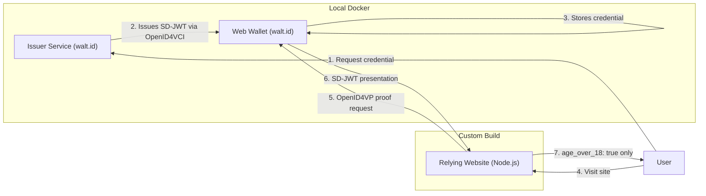
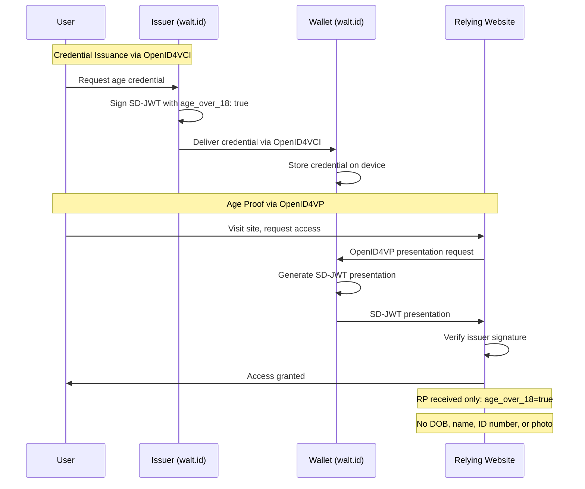

# Prototype Plan - Privacy-Preserving Age Verification
Date: 2026-02-17
Updated: 2026-02-17

---

## Goal

Build a small, self-contained working prototype that demonstrates the full privacy-preserving age verification flow end-to-end. The prototype must serve both as a technical foundation and as a convincing advocacy demo for policy and press audiences.

The prototype deliberately aligns with the EU Digital Identity Wallet (EUDI) architecture — using the same standards and protocols — so it can be cited as a working example of what EUDI-style verification looks like in practice.

---

## Approach: Hybrid

Rather than building every component from scratch, the prototype uses a hybrid approach:

- **Issuer + Wallet**: Use [walt.id](https://walt.id) open-source tooling, which implements the EUDI-aligned stack (OpenID4VCI, OpenID4VP, SD-JWT) and can run locally via Docker
- **Relying website**: Built custom — this is the advocacy-critical component that clearly demonstrates what data the site does and does not receive

This approach means:
- The demo uses real EUDI-compatible tooling, not a toy implementation
- It is credible to say "this uses the same stack the EU is deploying"
- The relying website remains simple, readable, and purpose-built for advocacy clarity
- Effort on the issuer/wallet side is significantly reduced

---

## Components

| Component | Implementation | Role |
|---|---|---|
| **Issuer service** | walt.id issuer kit (Docker, local) | Simulated trusted issuer. Issues a signed SD-JWT credential containing only `age_over_18: true`. Labeled clearly as a demo issuer standing in for a government or bank. |
| **User wallet** | walt.id web wallet (Docker, local) | Stores the credential on the user's device. Handles credential presentation via OpenID4VP. |
| **Relying website** | Custom (Node.js / TypeScript) | Requests age proof via OpenID4VP, verifies the SD-JWT signature, and displays only what it received — making explicit that no DOB, name, or ID was shared. |

---

## Credential Format: SD-JWT

SD-JWT is the correct choice because:

- It is the primary selective disclosure format used by EUDI
- It is the most deployable format today with solid library support
- It aligns with the IETF standard that governments and the EU wallet are converging on
- It is significantly simpler to implement than BBS+ or ZKP-based schemes

The credential will contain only: `age_over_18: true` — no date of birth, no name, no ID number.

---

## Protocols

| Protocol | Role |
|---|---|
| OpenID4VCI | Issuance of credential from issuer into wallet |
| OpenID4VP | Presentation of proof from wallet to relying website |
| SD-JWT | Credential and proof format (selective disclosure) |

These are the same protocols EUDI mandates. This is intentional.

---

## Tech Stack

| Component | Stack |
|---|---|
| Issuer + Wallet | walt.id (Docker) |
| Relying website | Node.js / TypeScript, Express |
| Credential format | SD-JWT via `@sd-jwt/core`, `jose` |
| Local orchestration | Docker Compose |

---

## The Flow

```
1. User visits Issuer (walt.id)  →  clicks "Get age credential"
   (In real life: issuer verifies DOB via gov record; here it is a button for demo purposes)

2. Issuer generates SD-JWT signed with its private key via OpenID4VCI
   → credential is issued into the walt.id web wallet

3. Wallet stores credential (device-side)

4. User visits Relying Website (custom)  →  clicks "Prove I'm over 18"

5. Relying website sends OpenID4VP presentation request to wallet

6. Wallet returns SD-JWT presentation containing only age_over_18: true

7. Relying website verifies issuer signature
   → displays: "age_over_18: true — no other data received"
   → explicitly lists what was NOT received: no DOB, no name, no ID number
```

---

## Effort Estimate

| Task | Effort |
|---|---|
| Set up walt.id issuer + wallet via Docker Compose | ~0.5 days |
| Configure issuer to issue age-only SD-JWT credential | ~0.5 days |
| Build relying website (OpenID4VP request, SD-JWT verification, result display) | ~1 day |
| Wiring, local dev setup, README | ~0.5 days |
| **Total** | **~2–3 days** |

---

## In Scope

- walt.id issuer configured to issue a credential with `age_over_18: true` only
- walt.id wallet stores and presents the credential
- Custom relying website requests proof via OpenID4VP
- Relying website verifies SD-JWT and displays result with explicit disclosure log
- Everything runs locally via Docker Compose and a single start command
- README explaining how to run it and what each component represents

---

## Out of Scope (for this prototype)

- Unlinkability across verifier requests (requires BBS+ or ZKP — significantly more complex)
- Credential revocation
- Real issuer integration (no public gov/bank issuance APIs exist yet)
- Mobile wallet (browser-based wallet only)
- Production security hardening
- Deployment to public infrastructure

---

## Issuer Note

Real-world issuers (government, bank, mobile carrier) do not yet expose public OpenID4VCI issuance endpoints to the general public. The prototype uses a clearly labeled simulated issuer via walt.id. The architecture is real and replaceable — when production issuers exist (as EUDI member states deploy them), only the issuer endpoint configuration needs to change. Everything else remains valid.

---

## EUDI Alignment

This prototype intentionally mirrors the EUDI architecture:

| EUDI concept | Prototype equivalent |
|---|---|
| Member state issuer | walt.id issuer (demo) |
| EUDI Wallet app | walt.id web wallet |
| Relying party | Custom relying website |
| OpenID4VCI | Used for issuance |
| OpenID4VP | Used for presentation |
| SD-JWT PID | SD-JWT with `age_over_18: true` |

This alignment is deliberate. The prototype can be presented as: "a working demonstration of what EUDI-style age verification looks like for any website, built with the same open standards the EU has mandated."

---

## Diagrams

### Component Architecture



### Full Protocol Flow



---

## What the Prototype Demonstrates

- The relying website receives **only** `age_over_18: true` and a valid cryptographic signature — nothing else
- The credential lives **on the user's device** in the wallet, not on any server
- The issuer issues and forgets — no log of what was issued to whom
- The same architecture is already being mandated and deployed across the EU
- Privacy-preserving age verification is not theoretical — it is being built right now
